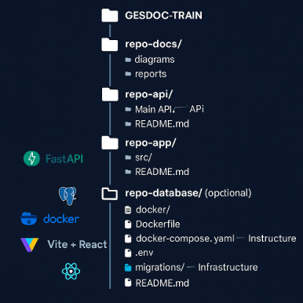

# 📅 APLICACIÓN WEB GESDOC & TRAIN
**Aplicación web con base a la aplicación movil del ICBF** 
--------------------------------------------------
## 📅 Información General
**Sistemas Distribuido** 

* Universidad: Corporación Universitaria CORHUILA & Instituto de Bienestar Familiar 
* Materia: Sistemas Distribuidos 
* Fecha de Inicio: 19/11/25             Fecha de Culminación: 28/11/25
* Estudiante: Carlos Daniel Culma Perdomo & Johan Verjan
* Profesor: Jesús Ariel Gonzales & Julian Quimbayo
---------------------------------------------------
## 🧾 Descripción
El proyecto consiste en el desarrollo de una **aplicación Web** diseñada para apoyar la **Documentación en base a la aplicación movil**, cuyo propósito es brindar información, interacción y acompañamiento a los asistentes en tiempo real.
--------------------------------------------------------
El sistema busca facilitar:
* brindar la Información de cada politica que tiene el Instituto de Bienestar familiar en la feria del 17 de octubre.
* ÉL envío de la notificación en tiempo real de la encuesta realizada en la App de los participantes dentro de la feria.
* La recompilación de los datos sobre la asistencia y la participación de los usuarios. 
----------------------------------------------------------
## 🎯 Objetivo General
Desarrollar un sistema web distribuido que permita gestionar de forma eficiente las políticas institucionales, documentos, categorías, entrenamientos y usuarios, garantizando disponibilidad, seguridad y accesibilidad desde cualquier dispositivo.
## 🎯 Objetivos Específicos
1. Implementar un módulo para la gestión documental: carga, consulta, categorización y actualización de políticas institucionales.  
2. Desarrollar un sistema para la administración de entrenamientos, incluyendo listado de cursos, documentos requeridos y asistencia.  
3. Construir una arquitectura distribuida usando FastAPI + PostgreSQL + React (Vite) dentro de contenedores Docker para favorecer portabilidad y despliegue.
------------------------------------------------------------
## ⚙️ Tecnologías y Arquitectura
| Componente                 | Tecnología                                                        |
| -------------------------- | ----------------------------------------------------------------- |
| **Frontend**               | React + Vite + TypeScript + CSS                                   |
| **Backend**                | FastAPI (Python)                                                  |
| **Base de Datos**          | PostgreSQL                                                        |
| **Contenedores**           | Docker / Docker Compose                                           |
| **Autenticación**          | JWT                                                               |
| **Estilo de Arquitectura** | Cliente – Servidor                                                |
| **Metodología**            | Scrum / Ágil                                                      |
| **DevOps**                 | GitHub Actions (CI/CD), SonarQube (Calidad), Versionado por ramas |
-----------------------------------------------------------------------------------------------------
## 📂 Estructura del Repositorio

docs:

# Manuales y documentación Con Diapositivas
# arquitectura
# Proyecto
-----------------------------------
# 📱 GESDOC - Sistema de Gestión Documental y Capacitación

GESDOC & TRAIN es un sistema web distribuido, diseñado para gestionar:

* Documentación institucional

* Entrenamientos, capacitaciones y asistencia

* Usuarios, roles y permisos

* Políticas internas, normativas y documentos obligatorios
Este proyecto está inspirado en las necesidades reales de instituciones como ICBF, ofreciendo una plataforma moderna, escalable y segura.

------------------------------------------------------

## 🧩 Arquitectura del Proyecto

GESDOC & TRAIN sigue una arquitectura profesional moderna:

🖥 Frontend – React + Vite

* Arquitectura por capas

* Vista de Dashboard

* Módulos: Employees, Trainings, Documents, My Profile

* Diseño UI tipo empresarial

🐍 Backend – FastAPI (Python)

Arquitectura modular (routers / services / models)

Seguridad con JWT

Endpoints REST para:

* Auth
* Users
* Employees
* Trainings
* Documents
* Attendance

🗄 Base de Datos – PostgreSQL

Modelo relacional dividido por subdominios:

* Security
* Training
* Documents

🐳 Infraestructura – Docker

Contenedores:

PostgreSQL

* Backend FastAPI
* Frontend React & Vite

Configuración con:
* Dockerfile
* docker-compose.yml
* .env
---

## 🚀 Instalación y Ejecución

🐳 1. Usando Docker (Recomendado)
docker-compose up --build

Esto levanta:

* PostgreSQL → puerto 5432

* Backend FastAPI → puerto 9000

* Frontend React/Vite → puerto 5173
-------------------------------------
🖥 2. Manual sin Docker
Backend
* cd repo-api/repo-api-1
* pip install -r requirements.txt
* uvicorn main:app --reload --port 9000

Frontend
* cd repo-app
* npm install
* npm run dev
----------------------------------------------
📌 Estado del Proyecto
| Módulo                          | Estado         |
| ------------------------------- | -------------- |
| Backend FastAPI                 | ✔ Completado   |
| Frontend React/Vite             | ✔ Avanzado     |
| PostgreSQL Modelo               | ✔ Finalizado   |
| Dockerización                   | ✔ Implementada |
| Documentación                   | ✔ En proceso   |
| UML (C4, secuencia, despliegue) | ✔ Generado     |
---------------------------------------------------------
Arquitectura: 

🌱 Futuras mejoras

* Añadir Dashboard analítico avanzado

* Integración de chatbot inteligente

* Reportería PDF automatizada

* Mejoras en roles y permisos

* Optimización de CI/CD con GitHub Actions